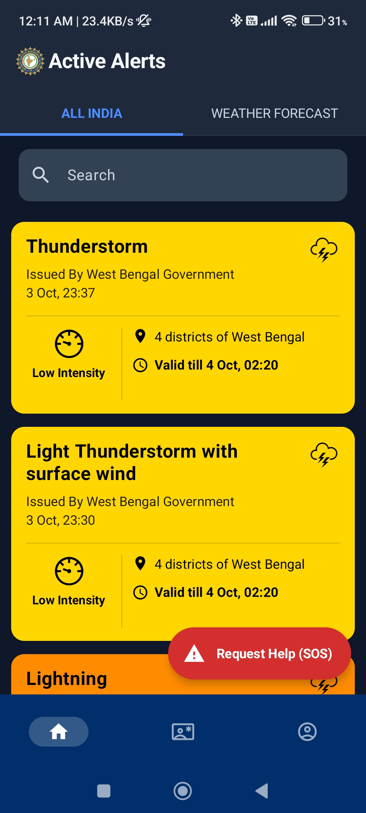
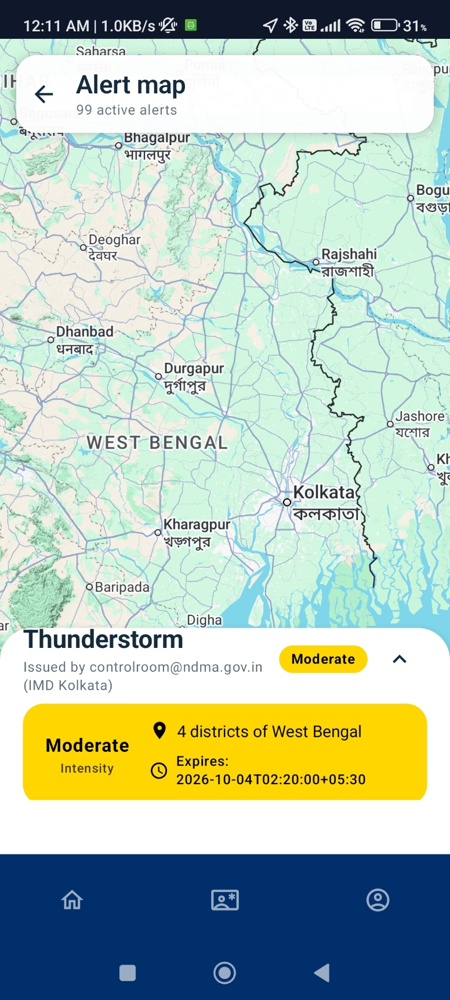
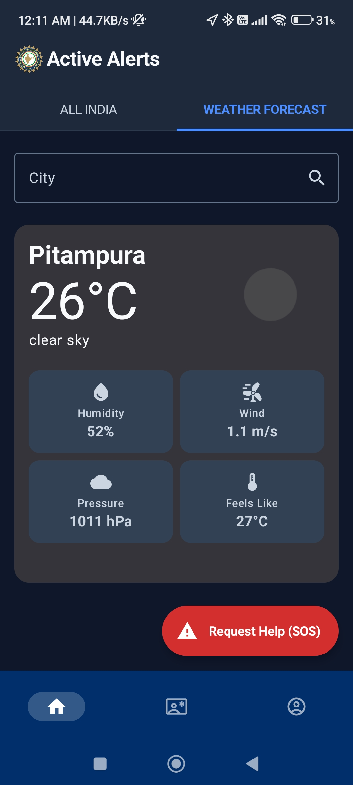
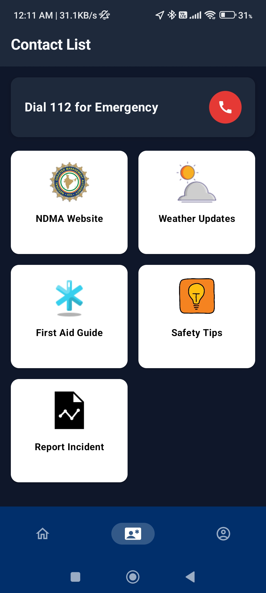
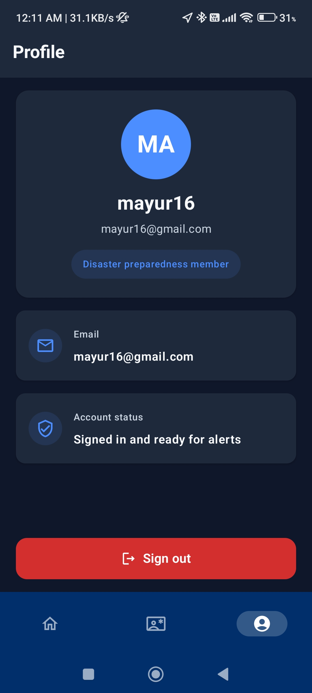

<div align="center">

# 🛡️DisasterPreparednessApp

### Real-Time Emergency Warning & Disaster Preparedness Platform for Android

[](https://kotlinlang.org)
[](https://developer.android.com)
[](https://developer.android.com/jetpack/compose)
[](https://dagger.dev/hilt/)
[](https://developer.android.com/training/data-storage/room)
[](https://firebase.google.com/docs/cloud-messaging)
[](LICENSE)

<br/>

**DisasterPreparednessApp** 
is an Android public safety and emergency management application that delivers real-time disaster warnings from official national feeds, provides interactive geospatial hazard mapping, and equips citizens with one-tap SOS emergency tools and weather forecasts.

*Designed for citizens, first responders, and emergency response teams seeking real-time hazard alerts and safety guidance.*

</div>

---

## 📷 Screenshots

<div align="center">
  <table>
    <tr>
      <td align="center" width="25%">
        <b>Active Disaster Feed</b><br/><br/>
        
      </td>
      <td align="center" width="25%">
        <b>Interactive Alert Map</b><br/><br/>
        
      </td>
      <td align="center" width="25%">
        <b>Weather Forecast</b><br/><br/>
        
      </td>
    </tr>
    <tr>
      <td align="center" width="25%">
        <b>Disaster Detail Brief</b><br/><br/>
        
      </td>
      <td align="center" width="25%">
        <b>Emergency Contacts</b><br/><br/>
        
      </td>
      <td align="center" width="25%">
        <b>User Profile & Settings</b><br/><br/>
        
      </td>
    </tr>
  </table>
</div>

---

## ✨ Features

- 🚨 **Live NDMA Alert Bulletins**: Fetches official Common Alerting Protocol (CAP) RSS feeds from the National Disaster Management Authority (NDMA Sachet) with intensity tags and expiry dates.
- 🗺️ **Geospatial Hazard Mapping**: Google Maps integration showing official hazard boundary polygon rings, affected district markers, and village points.
- 🖐️ **Finger-Slidable Bottom Sheet**: Retractable and expandable detail sheet on the map screen that smoothly reacts to finger drag gestures (`detectVerticalDragGestures`).
- 🔔 **Push Notifications (FCM + WorkManager)**: Dual notification pipeline powered by Firebase Cloud Messaging (topic subscriptions) and 15-minute WorkManager background polling.
- 🆘 **SOS Emergency Request**: One-tap distress system attached to live GPS coordinates with custom emergency notes and quick dialers (112, 108, 101, 1070).
- 🌤️ **Local Weather Forecasts**: OpenWeather integration with smart coordinate deduplication to eliminate unnecessary API requests.
- 🎨 **Shimmer Loading & Adaptive Dark Mode**: Material 3 styling with custom animated shimmer placeholders and dark/light color schemes.

---

## 🏗️ Architecture

The project follows **Clean Architecture** with a **Feature-First** structure to maintain separation of concerns, testability, and scalability across layers.

```text
com.example.disasterpreparednessapp
│
├── feature_disastermanagement/       # Disaster Alert Feed & Weather Module
│   ├── data/                         # Room Entities, DAOs, Retrofit API Services, Repositories
│   ├── domain/                       # Use Cases, Domain Models, Repository Contracts
│   └── presentation/                 # Compose UI Screens, ViewModels, Shimmer Effects
│
├── feature_map/                      # Geospatial Google Maps Module
│   ├── presentation/                 # LocationScreen, AlertMapViewModel, Boundary Rendering
│
├── feature_notification/             # Push Notification & FCM Module
│   ├── data/                         # NotificationSettingsDataStore, NotificationRepositoryImpl
│   ├── domain/                       # RegisterFcmTokenUseCase, SubscribeToDisasterTopicUseCase
│   ├── presentation/                 # DisasterFirebaseMessagingService, NotificationSettingsViewModel
│   └── di/                           # NotificationModule (Hilt)
│
├── feature_location/                 # Location Utilities & DataStore Preferences
│
└── di/                               # Core Hilt Dependency Injection Modules
```

### Layer Responsibilities
- **Presentation Layer**: UI rendering via Jetpack Compose and ViewModels managing state through `StateFlow`.
- **Domain Layer**: Pure Kotlin Use Cases encapsulating business logic and repository interfaces.
- **Data Layer**: Retrofit REST/XML services, Room database local caching, and repository implementations.

---

## 💻 Tech Stack

| Category | Technology |
| :--- | :--- |
| **Language** | [Kotlin 2.2.10](https://kotlinlang.org/) |
| **UI Framework** | [Jetpack Compose](https://developer.android.com/jetpack/compose) with Material 3 |
| **Dependency Injection** | [Hilt 2.60.1](https://dagger.dev/hilt/) with KSP |
| **Asynchronous Programming** | Kotlin Coroutines & StateFlow |
| **Local Persistence** | [Room Database 2.8.4](https://developer.android.com/training/data-storage/room) & [DataStore Preferences](https://developer.android.com/topic/libraries/architecture/datastore) |
| **Networking** | [Retrofit 3.0.0](https://square.github.io/retrofit/) with SimpleXML & Gson Converters |
| **Maps & Geolocation** | Google Maps Compose SDK 6.1.0 & Fused Location Provider 21.4.0 |
| **Push & Background Work** | Firebase Cloud Messaging (FCM 24.1.0) & WorkManager 2.9.1 |
| **Image Loading** | [Coil Compose 2.7.0](https://coil-kt.github.io/coil/) |

---

## 🚀 Getting Started

### Prerequisites
- **Android Studio Ladybug** (2024.2.1+) or newer
- **JDK 17**
- **Android SDK 35** (Minimum SDK 26+)
- Google Maps API Key & OpenWeather API Key

### Configuration

1. **Clone the Repository**:
   ```bash
   git clone https://github.com/your-username/DisasterPreparednessApp.git
   cd DisasterPreparednessApp
   ```

2. **Configure API Keys (`local.properties`)**:
   Create or update `local.properties` in the root folder with your keys:
   ```properties
   MAPS_API_KEY=YOUR_GOOGLE_MAPS_API_KEY
   WEATHER_API_KEY=YOUR_OPENWEATHER_API_KEY
   ```

3. **Configure Firebase**:
   - Register the app package `com.example.disasterpreparednessapp` in [Firebase Console](https://console.firebase.google.com/).
   - Download `google-services.json` and place it in the `app/` directory (`app/google-services.json`).

4. **Build and Run**:
   Open the project in Android Studio, sync Gradle, and run on a device or emulator.

---

## 🧪 Running Tests

### Unit Tests
Run local unit tests for ViewModels, Use Cases, and Repositories:
```bash
./gradlew testDebugUnitTest
```

### Instrumentation & UI Tests
Run UI and Compose tests on a connected device:
```bash
./gradlew connectedDebugAndroidTest
```

---

## 🗺️ Roadmap

- [x] NDMA Sachet CAP XML feed integration and alert parsing.
- [x] Google Maps geospatial polygon boundary rendering.
- [x] Finger-slidable bottom sheet with gesture velocity tracking.
- [x] FCM push notifications & WorkManager background polling.
- [x] SOS emergency request generator with location tagging.
- [ ] Offline-first tile caching for low-connectivity hazard zones.
- [ ] Multi-language support (Hindi, Tamil, Telugu, Bengali, Marathi).
- [ ] Crowd-sourced emergency shelter and food distribution point reporting.

---

## 🤝 Contributing

Contributions are welcome! Follow these steps to contribute:

1. Fork the project repository.
2. Create your feature branch: `git checkout -b feature/AmazingFeature`
3. Commit your changes: `git commit -m 'Add some AmazingFeature'`
4. Push to the branch: `git push origin feature/AmazingFeature`
5. Open a Pull Request.

---

## 📄 License

Distributed under the MIT License. See [`LICENSE`](LICENSE) for more information.

